# Nubiral BSA – User Guide

> **Step-by-Step Manual for Technical Proposal Generation**  
> Version 2.0 | December 2024

---

## 📖 Table of Contents

1. [Getting Started](#1-getting-started)
2. [Creating a New Proposal](#2-creating-a-new-proposal)
3. [Understanding the Agent Pipeline](#3-understanding-the-agent-pipeline)
4. [Working with Results](#4-working-with-results)
5. [Session Management](#5-session-management)
6. [Advanced Features](#6-advanced-features)
7. [Best Practices](#7-best-practices)
8. [Troubleshooting](#8-troubleshooting)

---

## 1. Getting Started

### 1.1 Application Interface Overview

```mermaid
graph TB
    subgraph Header["🔝 Global Header"]
        SB[📁 Sessions Button]
        LOGO[Nubiral BSA Logo]
        STATUS[Active Session Badge]
        SAVE[💾 Save Button]
    end

    subgraph Main["📱 Main Content Area"]
        INPUT[Step 1: Input Form]
        PROCESS[Step 2: Agent Console]
        RESULT[Step 3: Results Viewer]
    end

    subgraph Sidebar["📂 Left Sidebar"]
        SESSIONS[Session List]
        NEW[New Proposal]
    end
```



### 1.2 First Launch

1. Open the application at `http://localhost:5173`
2. You'll see the **Input Form** (Step 1)
3. The **Sessions** sidebar (📁) is accessible from the top-left

---

## 2. Creating a New Proposal

### 2.1 Input Form Fields

```mermaid
flowchart TD
    A[📝 Input Form] --> B[Client Company Name]
    A --> C[Business Case Description]
    A --> D[Target HyperScaler]
    A --> E[Proposal Language]
    A --> F[Agent Configuration]

    F --> G[Reasoning Model]
    F --> H[Image Model]
    F --> I[Context Density]
    F --> J[API Delay]
```



| Field | Description | Example |
|-------|-------------|---------|
| **Company Name** | Client organization | "Acme Corporation" |
| **Business Case** | Problem/need description | "Migrate legacy billing to microservices..." |
| **HyperScaler** | Target cloud platform | AWS, Azure, GCP, OCI |
| **Language** | Output language | English, Spanish, Portuguese, French, German |
| **Reasoning Model** | AI model for text | Gemini 3.0 Pro (Thinking) or Flash (Fast) |
| **Image Model** | AI model for visuals | Gemini 2.5 Flash or 3.0 Pro |
| **Context Density** | Information filtering | Low (summary), Medium, High (detailed) |
| **API Delay** | Rate limit control | 0-10 seconds between calls |

### 2.2 Writing Effective Business Cases

> **Best Practice:** Include problem, context, and desired outcome.

**Good Example:**
```
We need to modernize our customer service platform. Currently, our 
support team uses 5 disconnected tools, leading to 15-minute average 
response times. We want to consolidate into a unified cloud-native 
solution with AI-assisted responses, targeting sub-2-minute resolution.
```

**Poor Example:**
```
Build us a cloud thing.
```

---

## 3. Understanding the Agent Pipeline

### 3.1 Processing Stages

When you click **"Start Agent Workflow"**, the system executes:


### 3.2 SMART Evaluation Loop

After proposal generation, the **SMART Auditor** evaluates quality:

```mermaid
flowchart LR
    A[📄 Draft] --> B[✅ SMART Audit]
    B --> C{Score ≥ 90?}
    C -->|No| D[🔄 Auto-Fix]
    D --> A
    C -->|Yes| E[📋 Final]
```



**SMART Criteria (0-100 Score):**

| Criterion | What It Checks |
|-----------|----------------|
| **S**pecific | Are objectives and deliverables clearly defined? |
| **M**easurable | Are there quantifiable success metrics? |
| **A**chievable | Is the scope realistic with available resources? |
| **R**elevant | Does it align with business needs and ROI? |
| **T**ime-bound | Are milestones and timelines explicit? |

> **Note:** If score < 90 or critical issues found, the proposal is automatically regenerated with corrections.

### 3.3 Agent Console

During processing, the **Agent Console** shows real-time activity:

| Log Type | Color | Meaning |
|----------|-------|---------|
| `INFO` | Gray | System messages |
| `THINKING` | Blue | Agent reasoning |
| `SUCCESS` | Green | Task completed |
| `ERROR` | Red | Problem occurred |

---

## 4. Working with Results

### 4.1 Results Tab Navigation

```mermaid
graph LR
    A[📊 Business] --> B[🏗️ Architecture]
    B --> C[📄 Proposal]
    C --> D[💰 Cost]
    D --> E[🧠 Metacognition]
    E --> F[📋 Logs]
```



### 4.2 Tab Descriptions

#### 📊 Business Tab
- **Problem Statement:** Synthesized from your input
- **Root Cause Analysis:** Why the problem exists
- **Process Flaws:** Current pain points
- **ROI Analysis:** Expected business value
- **User Stories:** Derived requirements
- **Process Diagram:** Mermaid workflow visualization

#### 🏗️ Architecture Tab
- **Overview:** High-level solution description
- **Key Components:** Technology stack
- **Rationale:** Design justifications
- **Architecture Diagram:** Mermaid visualization
- **Rerun Button:** Regenerate with updated context

#### 📄 Proposal Tab
- Full Markdown document
- Cover image with logos
- Expandable sections
- Edit capability for each section
- Export to clipboard/download

#### 💰 Cost Tab
- **Weekly Plan:** Role allocations per week
- **Interactive Editor:** Modify hours directly
- **Stress Indicators:** Team workload analysis
- **Friction Analysis:** Aggressive timeline warnings
- **Cost Visualization:** AI-generated infographic

#### 🧠 Metacognition Tab
- **Customer Perspective:** Client's mental model
- **Nubiral Perspective:** Our delivery view
- **Proposal Perspective:** Document's promises
- **Consonance Matrix:** Alignment scoring (1-5)
- **Dissonance Alerts:** Risk warnings
- **Tension Management:** Balance recommendations

### 4.3 Using the Expand Feature

Each section has a **magnifier icon** (🔍) for deep-dive expansion:

```mermaid
flowchart LR
    A[📄 Section] --> B[🔍 Click Expand]
    B --> C[Configure Options]
    C --> D[AI Generates Detail]
    D --> E[Expanded View Added]
```



**Options:**
- **Custom Instruction:** Guide the expansion focus
- **Density:** Low (brief), Medium, High (exhaustive)

---

## 5. Session Management

### 5.1 Saving Your Work

1. Click **💾 Save** in the top-right header
2. Session is stored locally in your browser
3. Named automatically by company name

### 5.2 Loading a Session

1. Click **📁** (folder icon) in the top-left
2. Session sidebar opens
3. Click any session card to load
4. All state is restored (including images)

### 5.3 Session Sidebar Features

```mermaid
graph TB
    subgraph Sidebar["Session Manager"]
        NEW[➕ New Proposal]
        LIST[Session Cards]
        ACTIVE[Active Badge]
        DELETE[🗑️ Delete]
    end
```



| Action | How |
|--------|-----|
| New Session | Click "New Proposal" button |
| Load Session | Click session card |
| Delete Session | Hover + click trash icon |
| Identify Active | Look for "Active" badge |

---

## 6. Advanced Features

### 6.1 Regenerating Architecture

After modifying KYC or Business Case data:

1. Navigate to **Architecture** tab
2. Click **"Rerun Analysis (Update)"**
3. Agent regenerates with current context


### 6.2 Cost Estimation Editor

Interactive cost modification:


### 6.3 Chat Widget (Expert Assistant)

Available in Results view for:
- Architecture questions
- Regenerating images
- Expanding sections
- Design modifications

---

## 7. Best Practices

### 7.1 For Best Results

| Do | Don't |
|----|-------|
| ✅ Provide detailed business context | ❌ Use vague descriptions |
| ✅ Specify industry and constraints | ❌ Skip regulatory requirements |
| ✅ Save frequently | ❌ Rely on browser state |
| ✅ Use appropriate context density | ❌ Always use "High" (wastes tokens) |
| ✅ Review and edit AI outputs | ❌ Accept without review |

### 7.2 Workflow Recommendations


---

## 8. Troubleshooting

### 8.1 Common Issues

| Problem | Solution |
|---------|----------|
| API rate limit error | Increase "API Delay" slider |
| Empty sections | Lower context density, retry |
| Image generation fails | Switch to Flash model |
| Session not loading | Check browser IndexedDB quota |
| Mermaid diagram broken | Report to BSA team |

### 8.2 Error Recovery


### 8.3 Clearing Data

To reset the application:
1. Open browser DevTools (F12)
2. Go to **Application** → **IndexedDB**
3. Delete `nubi_proposals_db`
4. Refresh the page

---

## 📞 Support

For issues or feature requests, contact the **Nubiral BSA Team**.

---

<p align="center">
<strong>Nubiral BSA User Guide v2.0</strong><br>
<em>Empowering Technical Excellence Through AI</em>
</p>
