# Nubiral BSA – Guía de Usuario

> **Manual Paso a Paso para Generación de Propuestas Técnicas**  
> Versión 2.0 | Diciembre 2024

---

## 📖 Tabla de Contenidos

1. [Primeros Pasos](#1-primeros-pasos)
2. [Crear una Nueva Propuesta](#2-crear-una-nueva-propuesta)
3. [Entendiendo el Pipeline de Agentes](#3-entendiendo-el-pipeline-de-agentes)
4. [Trabajando con Resultados](#4-trabajando-con-resultados)
5. [Gestión de Sesiones](#5-gestión-de-sesiones)
6. [Funciones Avanzadas](#6-funciones-avanzadas)
7. [Mejores Prácticas](#7-mejores-prácticas)
8. [Solución de Problemas](#8-solución-de-problemas)

---

## 1. Primeros Pasos

### 1.1 Vista General de la Interfaz

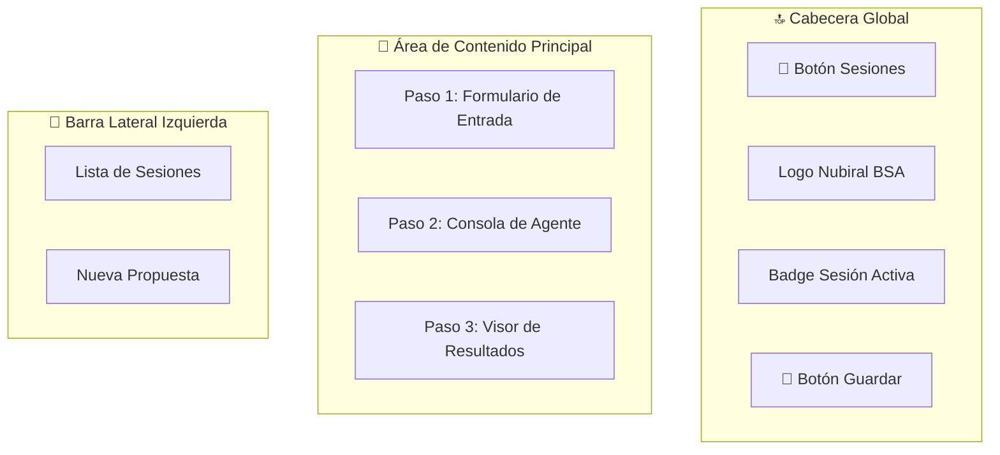

### 1.2 Primera Ejecución

1. Abrir la aplicación en `http://localhost:5173`
2. Verás el **Formulario de Entrada** (Paso 1)
3. La barra lateral de **Sesiones** (📁) es accesible desde la esquina superior izquierda

---

## 2. Crear una Nueva Propuesta

### 2.1 Campos del Formulario de Entrada

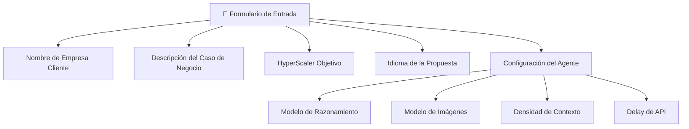

| Campo | Descripción | Ejemplo |
|-------|-------------|---------|
| **Nombre Empresa** | Organización cliente | "Acme Corporation" |
| **Caso de Negocio** | Descripción del problema/necesidad | "Migrar facturación legacy a microservicios..." |
| **HyperScaler** | Plataforma cloud objetivo | AWS, Azure, GCP, OCI |
| **Idioma** | Idioma de salida | Inglés, Español, Portugués, Francés, Alemán |
| **Modelo Razonamiento** | Modelo IA para texto | Gemini 3.0 Pro (Thinking) o Flash (Rápido) |
| **Modelo Imágenes** | Modelo IA para visuales | Gemini 2.5 Flash o 3.0 Pro |
| **Densidad Contexto** | Filtrado de información | Baja (resumen), Media, Alta (detallado) |
| **Delay API** | Control de límite de tasa | 0-10 segundos entre llamadas |

### 2.2 Escribiendo Casos de Negocio Efectivos

> **Mejor Práctica:** Incluir problema, contexto y resultado deseado.

**Buen Ejemplo:**
```
Necesitamos modernizar nuestra plataforma de servicio al cliente. 
Actualmente, nuestro equipo de soporte usa 5 herramientas desconectadas, 
resultando en tiempos de respuesta promedio de 15 minutos. Queremos 
consolidar en una solución cloud-native unificada con respuestas 
asistidas por IA, apuntando a resolución en menos de 2 minutos.
```

**Mal Ejemplo:**
```
Construyan algo en la nube.
```

---

## 3. Entendiendo el Pipeline de Agentes

### 3.1 Etapas de Procesamiento

Al hacer clic en **"Iniciar Workflow de Agente"**, el sistema ejecuta:

```mermaid
gantt
    title Línea de Tiempo del Pipeline de Agentes
    dateFormat X
    axisFormat %s

    section Investigación
    Agente KYC           :a1, 0, 15s
    Infografía KYC       :a2, after a1, 5s

    section Análisis
    Analista de Negocio  :b1, after a2, 10s
    Infografía Negocio   :b2, after b1, 5s

    section Diseño
    Agente Arquitecto    :c1, after b2, 15s
    Bucle de Validación  :c2, after c1, 5s
    Infografía Arq.      :c3, after c2, 5s

    section Espera
    Aprobación Usuario   :milestone, after c3, 0
    
    section Generación
    Escritor Propuesta   :d1, after c3, 10s
    Imagen Portada       :d2, after d1, 5s
    Auditoría SMART      :d3, after d2, 5s
    Auto-Corrección      :d4, after d3, 5s
```

### 3.2 Bucle de Evaluación SMART

Después de la generación de propuesta, el **Auditor SMART** evalúa la calidad:

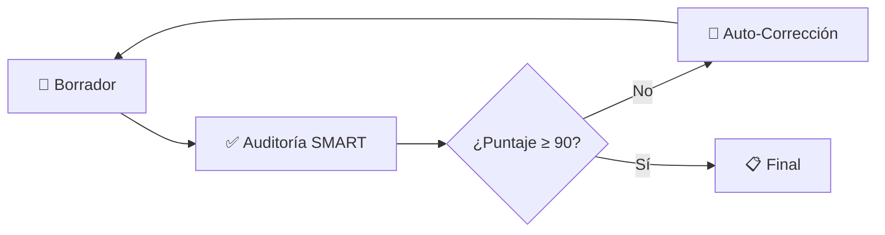

**Criterios SMART (Puntaje 0-100):**

| Criterio | Qué Evalúa |
|----------|------------|
| **S**pecific (Específico) | ¿Los objetivos y entregables están claramente definidos? |
| **M**easurable (Medible) | ¿Hay métricas de éxito cuantificables? |
| **A**chievable (Alcanzable) | ¿El alcance es realista con los recursos disponibles? |
| **R**elevant (Relevante) | ¿Está alineado con necesidades del negocio y ROI? |
| **T**ime-bound (Temporal) | ¿Los hitos y cronogramas son explícitos? |

> **Nota:** Si el puntaje < 90 o se encuentran problemas críticos, la propuesta se regenera automáticamente con correcciones.

### 3.3 Consola del Agente

Durante el procesamiento, la **Consola del Agente** muestra actividad en tiempo real:

| Tipo de Log | Color | Significado |
|-------------|-------|-------------|
| `INFO` | Gris | Mensajes del sistema |
| `THINKING` | Azul | Razonamiento del agente |
| `SUCCESS` | Verde | Tarea completada |
| `ERROR` | Rojo | Problema ocurrido |

---

## 4. Trabajando con Resultados

### 4.1 Navegación de Pestañas de Resultados

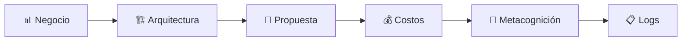

### 4.2 Descripción de Pestañas

#### 📊 Pestaña Negocio
- **Declaración del Problema:** Sintetizado de tu entrada
- **Análisis de Causa Raíz:** Por qué existe el problema
- **Fallas de Proceso:** Puntos de dolor actuales
- **Análisis ROI:** Valor de negocio esperado
- **Historias de Usuario:** Requerimientos derivados
- **Diagrama de Proceso:** Visualización de flujo Mermaid

#### 🏗️ Pestaña Arquitectura
- **Resumen:** Descripción de alto nivel de la solución
- **Componentes Clave:** Stack tecnológico
- **Justificación:** Razones del diseño
- **Diagrama de Arquitectura:** Visualización Mermaid
- **Botón Reejecutar:** Regenerar con contexto actualizado

#### 📄 Pestaña Propuesta
- Documento Markdown completo
- Imagen de portada con logos
- Secciones expandibles
- Capacidad de edición por sección
- Exportar al portapapeles/descargar

#### 💰 Pestaña Costos
- **Plan Semanal:** Asignaciones de roles por semana
- **Editor Interactivo:** Modificar horas directamente
- **Indicadores de Estrés:** Análisis de carga de trabajo
- **Análisis de Fricción:** Advertencias de cronograma agresivo
- **Visualización de Costos:** Infografía generada por IA

#### 🧠 Pestaña Metacognición
- **Perspectiva del Cliente:** Modelo mental del cliente
- **Perspectiva Nubiral:** Nuestra visión de entrega
- **Perspectiva de la Propuesta:** Promesas del documento
- **Matriz de Consonancia:** Puntuación de alineación (1-5)
- **Alertas de Disonancia:** Advertencias de riesgo
- **Gestión de Tensiones:** Recomendaciones de equilibrio

### 4.3 Usando la Función Expandir

Cada sección tiene un **icono de lupa** (🔍) para expansión profunda:

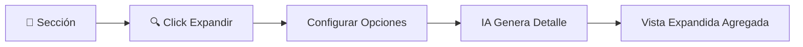

**Opciones:**
- **Instrucción Personalizada:** Guiar el enfoque de expansión
- **Densidad:** Baja (breve), Media, Alta (exhaustiva)

---

## 5. Gestión de Sesiones

### 5.1 Guardando Tu Trabajo

1. Clic en **💾 Guardar** en la cabecera superior derecha
2. La sesión se almacena localmente en tu navegador
3. Nombrada automáticamente por el nombre de la empresa

### 5.2 Cargando una Sesión

1. Clic en **📁** (icono de carpeta) en la esquina superior izquierda
2. Se abre la barra lateral de sesiones
3. Clic en cualquier tarjeta de sesión para cargar
4. Todo el estado se restaura (incluyendo imágenes)

### 5.3 Funciones de la Barra Lateral de Sesiones

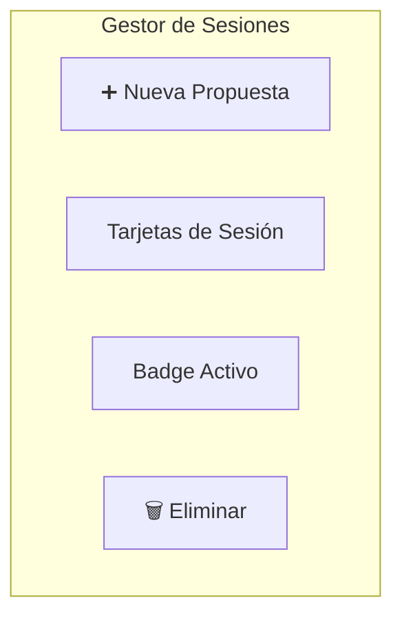

| Acción | Cómo |
|--------|------|
| Nueva Sesión | Clic en botón "Nueva Propuesta" |
| Cargar Sesión | Clic en tarjeta de sesión |
| Eliminar Sesión | Hover + clic en icono de papelera |
| Identificar Activa | Buscar badge "Activo" |

---

## 6. Funciones Avanzadas

### 6.1 Regenerando Arquitectura

Después de modificar datos de KYC o Caso de Negocio:

1. Navegar a pestaña **Arquitectura**
2. Clic en **"Reejecutar Análisis (Actualizar)"**
3. El agente regenera con el contexto actual

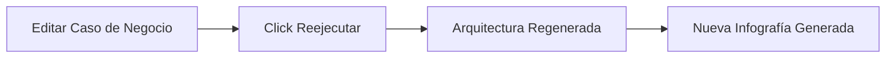

### 6.2 Editor de Estimación de Costos

Modificación interactiva de costos:

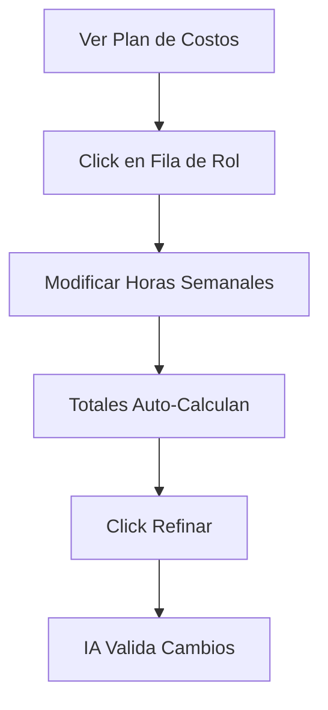

### 6.3 Widget de Chat (Asistente Experto)

Disponible en la vista de Resultados para:
- Preguntas de arquitectura
- Regenerar imágenes
- Expandir secciones
- Modificaciones de diseño

---

## 7. Mejores Prácticas

### 7.1 Para Mejores Resultados

| Hacer | No Hacer |
|-------|----------|
| ✅ Proporcionar contexto de negocio detallado | ❌ Usar descripciones vagas |
| ✅ Especificar industria y restricciones | ❌ Omitir requisitos regulatorios |
| ✅ Guardar frecuentemente | ❌ Confiar en el estado del navegador |
| ✅ Usar densidad de contexto apropiada | ❌ Usar siempre "Alta" (desperdicia tokens) |
| ✅ Revisar y editar salidas de IA | ❌ Aceptar sin revisar |

### 7.2 Recomendaciones de Flujo de Trabajo

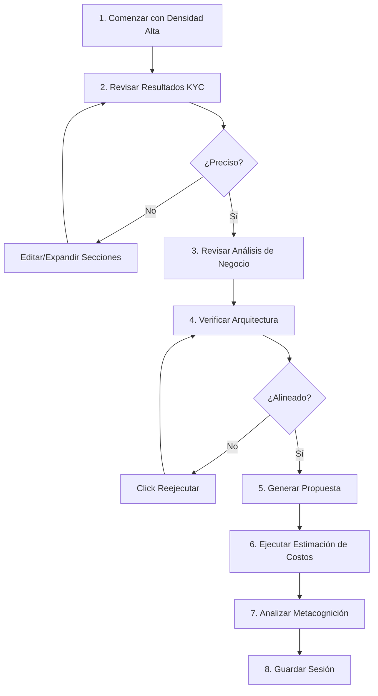

---

## 8. Solución de Problemas

### 8.1 Problemas Comunes

| Problema | Solución |
|----------|----------|
| Error de límite de API | Aumentar slider "Delay de API" |
| Secciones vacías | Reducir densidad de contexto, reintentar |
| Falla generación de imagen | Cambiar a modelo Flash |
| Sesión no carga | Verificar cuota de IndexedDB del navegador |
| Diagrama Mermaid roto | Reportar al equipo BSA |

### 8.2 Recuperación de Errores

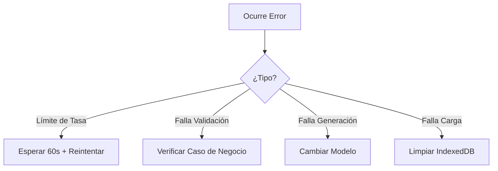

### 8.3 Limpiando Datos

Para reiniciar la aplicación:
1. Abrir DevTools del navegador (F12)
2. Ir a **Application** → **IndexedDB**
3. Eliminar `nubi_proposals_db`
4. Refrescar la página

---

## 📞 Soporte

Para problemas o solicitudes de funciones, contactar al **Equipo BSA de Nubiral**.

---

<p align="center">
<strong>Guía de Usuario Nubiral BSA v2.0</strong><br>
<em>Potenciando la Excelencia Técnica con IA</em>
</p>
