# Nubiral BSA – Chat Assistant Reference

> **Expert Assistant Capabilities & Context Guide**  
> Version 2.0 | December 2024

---

## 🤖 Overview

The **Nubiral BSA Expert** is a **supportive guide** embedded in the results view. Its primary role is to help users understand and use the tool effectively—like a senior BSA consultant sitting next to them.

### Key Philosophy:
- ✅ **Explains** what users see in each tab
- ✅ **Guides** through the workflow step by step
- ✅ **Answers questions** about generated artifacts
- ⚠️ **Only acts when explicitly asked**—no automatic triggers
- ❌ **Never chains actions** (updating architecture does NOT auto-generate proposal)

```mermaid
graph TB
    subgraph Context["📊 Available Context"]
        KYC[🔍 KYC Research]
        BIZ[📈 Business Analysis]
        ARCH[🏗️ Solution Design]
        COST[💰 Cost Estimation]
        LOGS[📋 Agent Logs]
        PROP[📄 Proposal Markdown]
    end

    subgraph Assistant["🤖 BSA Expert"]
        AI[Gemini Flash Model]
        HIST[Chat History]
        TOOLS[Tool Calling]
    end

    subgraph Actions["⚡ Available Actions"]
        IMG[🖼️ Regenerate Image]
        EXP[🔍 Expand Section]
        UPD[✏️ Update Design]
    end

    Context --> Assistant
    Assistant --> Actions
```



---

## 📚 Context Access

The assistant has **read access** to the following artifacts:

| Artifact | What It Knows | Example Questions |
|----------|---------------|-------------------|
| **KYC Research** | Company summary, SWOT, strategic goals, industry landscape, competitors | "What are the main risks identified in the KYC?" |
| **Business Analysis** | Problem statement, root causes, ROI projections, user stories | "Explain the expected ROI breakdown" |
| **Solution Design** | Architecture overview, key components, Mermaid diagram, rationale | "Why did you choose EKS over ECS?" |
| **Cost Estimation** | Role allocations, weekly hours, stress indicators, total cost | "Which role has the highest workload?" |
| **Agent Logs** | Last 30 non-info logs showing agent reasoning and decisions | "What issues did the validator find?" |
| **Proposal** | Full generated Markdown document | "Summarize the implementation timeline" |

> **Anti-Hallucination:** The assistant explicitly checks which data is available and will inform you if a section hasn't been generated yet.

---

## 📖 Embedded System Documentation

The assistant has **built-in knowledge** of:

| Document | Contents |
|----------|----------|
| **README** | Feature overview, pipeline flow, SMART loop explanation |
| **SYSTEM_SPEC** | Agent functions, context density, user workflow, available tabs |

This allows it to answer questions like:
- "How do I generate a proposal?"
- "What does the SMART evaluation do?"
- "Which tab shows the cost breakdown?"

---

## ⚡ Available Tools (Actions)

The assistant can execute **3 actions** on your behalf via tool calling:

### 1. 🖼️ Regenerate Visual Asset


**Trigger:** "Please regenerate the cover image with a more modern style"

**Parameters:**
| Parameter | Type | Description |
|-----------|------|-------------|
| `asset_type` | enum | `cover`, `concept`, or `infographic` |
| `instruction` | string | Optional styling/content guidance |

---

### 2. 🔍 Expand KYC Section


**Trigger:** "Can you provide more detail on the regulatory constraints?"

**Parameters:**
| Parameter | Type | Description |
|-----------|------|-------------|
| `section_name` | string | KYC section to expand (e.g., "regulatoryConstraints") |

---

### 3. ✏️ Update Solution Design


**Trigger:** "Add a Redis caching layer to the architecture"

**Parameters:**
| Parameter | Type | Description |
|-----------|------|-------------|
| `mermaid_code` | string | Updated Mermaid diagram code |
| `architecture_overview` | string | Optional new overview text |
| `rationale` | string | Optional update rationale |

---

## 💬 Example Conversations

### Understanding Decisions

```
You: Why did the architect choose AWS Lambda over ECS for the processing layer?

Expert: Based on the business analysis, the key driver was cost optimization 
for variable workloads. The agent logs show:

[THINKING] Evaluating compute options for batch processing...
[SUCCESS] Lambda selected - aligns with pay-per-execution model and 
expected 2000 daily invocations.

The rationale emphasizes the client's requirement for minimal operational 
overhead, which Lambda provides with its fully managed infrastructure.
```

### Requesting Changes

```
You: Add a message queue between the API Gateway and Lambda

Expert: I'll update the architecture to include an SQS queue for decoupling. 
This will improve resilience and allow for better load handling.

[Tool Called: update_solution_design]
✅ Design updated. The Mermaid diagram now shows:
API Gateway → SQS Queue → Lambda → DynamoDB
```

### Regenerating Assets

```
You: The cover image looks too generic. Make it more futuristic with 
a focus on cloud infrastructure.

Expert: I'll regenerate the cover with your specifications.

[Tool Called: regenerate_visual_asset]
✅ Cover image regenerated with futuristic cloud theme.
```

---

## 🧠 How It Works


---

## ⚠️ Limitations

| Limitation | Description |
|------------|-------------|
| **Read-Only Business Analysis** | Cannot modify business analysis directly |
| **No Proposal Editing** | Cannot edit proposal markdown (use section editors) |
| **No Cost Modification** | Cannot change cost allocations via chat |
| **Context Window** | Last 30 log entries only (to save tokens) |
| **Rate Limits** | Subject to Gemini API rate limits |

---

## 📍 Access Location

The chat assistant is available as a **floating button** in the bottom-right corner when viewing results:

```
┌─────────────────────────────────────┐
│           Results View              │
│                                     │
│  [KYC] [Business] [Design] ...      │
│                                     │
│                                     │
│                     ┌───────────┐   │
│                     │ 💬 Expert │   │
│                     └───────────┘   │
└─────────────────────────────────────┘
```

Click to open the chat window. Press **Enter** to send messages.

---

<p align="center">
<strong>Nubiral BSA Chat Assistant v2.0</strong>
</p>
