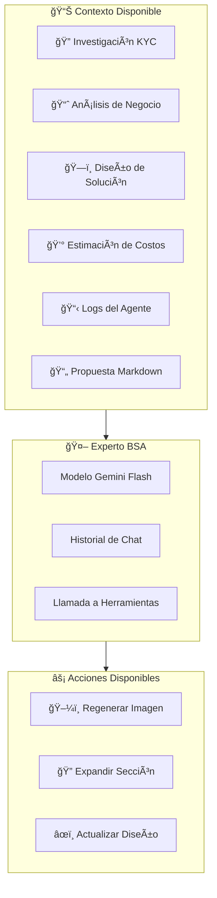
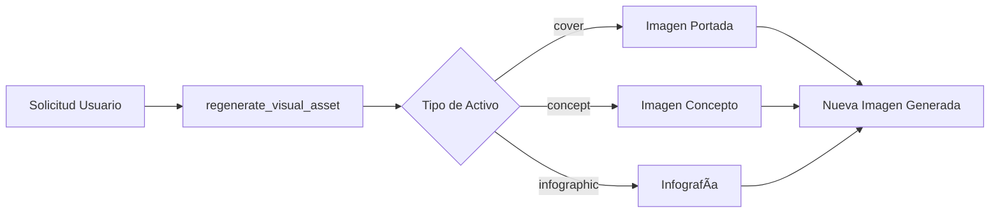
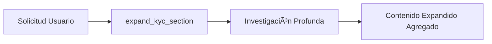
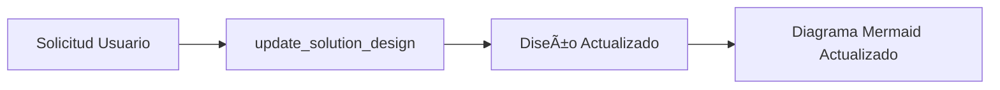

# Nubiral BSA – Referencia del Asistente de Chat

> **Capacidades del Asistente Experto y Guía de Contexto**  
> Versión 2.0 | Diciembre 2024

---

## 🤖 Descripción General

El **Experto BSA de Nubiral** es una **guía de apoyo** integrada en la vista de resultados. Su rol principal es ayudar a los usuarios a entender y usar la herramienta efectivamente—como un consultor BSA senior sentado a su lado.

### Filosofía Clave:
- ✅ **Explica** lo que los usuarios ven en cada pestaña
- ✅ **Guía** a través del flujo de trabajo paso a paso
- ✅ **Responde preguntas** sobre artefactos generados
- âš ï¸ **Solo actúa cuando se le pide explícitamente**—sin triggers automáticos
- ⌠**Nunca encadena acciones** (actualizar arquitectura NO auto-genera propuesta)



---

## 📚 Acceso al Contexto

El asistente tiene **acceso de lectura** a los siguientes artefactos:

| Artefacto | Qué Conoce | Preguntas de Ejemplo |
|-----------|------------|----------------------|
| **Investigación KYC** | Resumen de empresa, FODA, objetivos estratégicos, panorama industrial, competidores | "¿Cuáles son los principales riesgos identificados en el KYC?" |
| **Análisis de Negocio** | Declaración del problema, causas raíz, proyecciones de ROI, historias de usuario | "Explica el desglose de ROI esperado" |
| **Diseño de Solución** | Resumen de arquitectura, componentes clave, diagrama Mermaid, justificación | "¿Por qué elegiste EKS sobre ECS?" |
| **Estimación de Costos** | Asignaciones de roles, horas semanales, indicadores de estrés, costo total | "¿Qué rol tiene la mayor carga de trabajo?" |
| **Logs del Agente** | Últimos 30 logs no-info mostrando razonamiento y decisiones del agente | "¿Qué problemas encontró el validador?" |
| **Propuesta** | Documento Markdown completo generado | "Resume el cronograma de implementación" |

> **Anti-Alucinación:** El asistente verifica explícitamente qué datos están disponibles y te informará si una sección aún no ha sido generada.

---

## 📖 Documentación del Sistema Integrada

El asistente tiene **conocimiento incorporado** de:

| Documento | Contenidos |
|-----------|------------|
| **README** | Resumen de funciones, flujo del pipeline, explicación del bucle SMART |
| **SYSTEM_SPEC** | Funciones de agentes, densidad de contexto, flujo de usuario, pestañas disponibles |

Esto le permite responder preguntas como:
- "¿Cómo genero una propuesta?"
- "¿Qué hace la evaluación SMART?"
- "¿Cuál pestaña muestra el desglose de costos?"

---

## âš¡ Herramientas Disponibles (Acciones)

El asistente puede ejecutar **3 acciones** en tu nombre mediante llamadas a herramientas:

### 1. ğŸ–¼ï¸ Regenerar Activo Visual



**Activación:** "Por favor regenera la imagen de portada con un estilo más moderno"

**Parámetros:**
| Parámetro | Tipo | Descripción |
|-----------|------|-------------|
| `asset_type` | enum | `cover`, `concept`, o `infographic` |
| `instruction` | string | Guía opcional de estilo/contenido |

---

### 2. 🔠Expandir Sección KYC



**Activación:** "¿Puedes dar más detalle sobre las restricciones regulatorias?"

**Parámetros:**
| Parámetro | Tipo | Descripción |
|-----------|------|-------------|
| `section_name` | string | Sección KYC a expandir (ej. "regulatoryConstraints") |

---

### 3. âœï¸ Actualizar Diseño de Solución



**Activación:** "Agrega una capa de cache Redis a la arquitectura"

**Parámetros:**
| Parámetro | Tipo | Descripción |
|-----------|------|-------------|
| `mermaid_code` | string | Código de diagrama Mermaid actualizado |
| `architecture_overview` | string | Nuevo texto de resumen opcional |
| `rationale` | string | Justificación de actualización opcional |

---

## 💬 Ejemplos de Conversación

### Entendiendo Decisiones

```
Tú: ¿Por qué el arquitecto eligió AWS Lambda sobre ECS para la capa de procesamiento?

Experto: Basándome en el análisis de negocio, el factor principal fue la 
optimización de costos para cargas de trabajo variables. Los logs del agente muestran:

[THINKING] Evaluando opciones de cómputo para procesamiento batch...
[SUCCESS] Lambda seleccionado - alineado con modelo de pago por ejecución y 
2000 invocaciones diarias esperadas.

La justificación enfatiza el requisito del cliente de mínima sobrecarga 
operacional, que Lambda proporciona con su infraestructura totalmente administrada.
```

### Solicitando Cambios

```
Tú: Agrega una cola de mensajes entre el API Gateway y Lambda

Experto: Actualizaré la arquitectura para incluir una cola SQS para desacoplamiento. 
Esto mejorará la resiliencia y permitirá mejor manejo de carga.

[Herramienta Llamada: update_solution_design]
✅ Diseño actualizado. El diagrama Mermaid ahora muestra:
API Gateway → Cola SQS → Lambda → DynamoDB
```

### Regenerando Activos

```
Tú: La imagen de portada se ve muy genérica. Hazla más futurista con 
enfoque en infraestructura cloud.

Experto: Regeneraré la portada con tus especificaciones.

[Herramienta Llamada: regenerate_visual_asset]
✅ Imagen de portada regenerada con tema cloud futurista.
```

---

## 🧠 Cómo Funciona


---

## âš ï¸ Limitaciones

| Limitación | Descripción |
|------------|-------------|
| **Análisis de Negocio Solo Lectura** | No puede modificar el análisis de negocio directamente |
| **Sin Edición de Propuesta** | No puede editar markdown de propuesta (usar editores de sección) |
| **Sin Modificación de Costos** | No puede cambiar asignaciones de costos vía chat |
| **Ventana de Contexto** | Solo últimas 30 entradas de log (para ahorrar tokens) |
| **Límites de Tasa** | Sujeto a límites de tasa de API Gemini |

---

## 📠Ubicación de Acceso

El asistente de chat está disponible como un **botón flotante** en la esquina inferior derecha al ver resultados:

```
┌─────────────────────────────────────â”
│         Vista de Resultados         │
│                                     │
│  [KYC] [Negocio] [Diseño] ...       │
│                                     │
│                                     │
│                     ┌───────────┠  │
│                     │ 💬 Experto│   │
│                     └───────────┘   │
└─────────────────────────────────────┘
```

Clic para abrir la ventana de chat. Presiona **Enter** para enviar mensajes.

---

<p align="center">
<strong>Asistente de Chat Nubiral BSA v2.0</strong>
</p>
