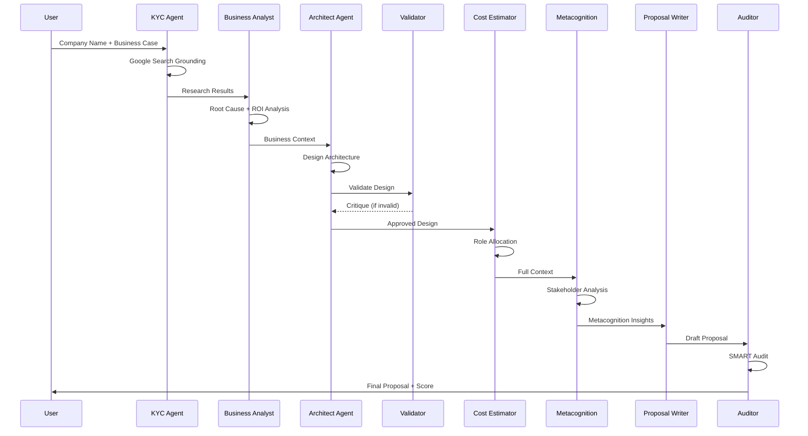

# Nubiral BSA – GenAI Architect Agent

> **AI-Powered Technical Proposal Generation Platform**  
> Version 2.0 | December 2024


## 🎯 Overview

Nubiral BSA is an **agentic AI system** that automates the creation of cloud architecture technical proposals. It orchestrates a multi-agent pipeline to research companies, analyze business cases, design cloud solutions, estimate costs, and generate professional documentation—all powered by Google's Gemini models.

```mermaid
graph LR
    A[📝 User Input] --> B[🔍 KYC Agent]
    B --> C[📊 Business Analyst]
    C --> D[🏗️ Architect Agent]
    D --> E[✓ Validator]
    E -->|Invalid| D
    E -->|Valid| F[💰 Cost Estimator]
    F --> G[🧠 Metacognition]
    G --> H[📄 Proposal Generator]
    H --> I[✅ SMART Auditor]
    I -->|Score < 90| H
    I -->|Score ≥ 90| J[📋 Final Proposal]
```



### 🔄 SMART Evaluation Loop

The system includes an **automated quality assurance loop**:

1. **Proposal Generated** → Sent to SMART Auditor
2. **SMART Score Calculated** (0-100) based on:
   - **S**pecific: Clear objectives and deliverables
   - **M**easurable: Quantifiable success metrics
   - **A**chievable: Realistic scope and timeline
   - **R**elevant: Aligned with business needs
   - **T**ime-bound: Defined milestones
3. **If Score < 90 OR Critical Issues Found**:
   - Feedback extracted from evaluation
   - Proposal regenerated with corrections
   - Re-evaluated until quality threshold met


## ✨ Key Features

| Feature | Description |
|---------|-------------|
| **🔍 KYC Research** | Google Search grounding for real-time company intelligence |
| **📊 Business Analysis** | Root cause analysis, pain points, ROI modeling |
| **🏗️ Architecture Design** | Multi-cloud support (AWS, Azure, GCP, OCI) with Mermaid diagrams |
| **💰 Cost Estimation** | Role-based weekly allocation with stress indicators |
| **🧠 Metacognition** | Consonance/Dissonance analysis between stakeholders |
| **🖼️ AI Infographics** | Auto-generated visualizations for each section |
| **💾 Session Management** | IndexedDB persistence for save/load across sessions |
| **🌐 Multi-language** | English, Spanish, Portuguese, French, German |

---

## 🚀 Quick Start

### Prerequisites

- Node.js 18+
- Google AI API Key (Gemini 2.5/3.0 access)

### Installation

```bash
# Clone repository
git clone https://github.com/nubiral/bsa-agent.git
cd bsa-agent

# Install dependencies
npm install

# Configure API Key
echo "API_KEY=your_gemini_api_key" > .env.local

# Start development server
npm run dev
```

### Access

Open `http://localhost:5173` in your browser.

---

## 📁 Project Structure

```
nubi-bsa-propv1/
├── App.tsx                 # Main application orchestrator
├── types.ts                # TypeScript interfaces
├── services/
│   ├── geminiService.ts    # AI Agent functions (42 exports)
│   └── sessionService.ts   # IndexedDB persistence
├── components/
│   ├── InputStep.tsx       # Request form
│   ├── ProcessingStep.tsx  # Agent runtime console
│   ├── ResultStep.tsx      # Multi-tab results viewer
│   ├── ChatWidget.tsx      # Expert assistant
│   └── SessionManager.tsx  # Left sidebar session list
├── prompts/                # AI prompt templates
├── config/
│   └── models.ts           # Model configuration
└── utils/
    └── logoUtils.ts        # Image compositing
```

---

## 🧠 Agent Pipeline



---

## ⚙️ Configuration

### Agent Settings

| Parameter | Default | Description |
|-----------|---------|-------------|
| `textModel` | `gemini-3-pro-preview` | Reasoning model (Pro/Flash) |
| `imageModel` | `gemini-2.5-flash-image` | Image generation model |
| `contextDensity` | `high` | Information filtering (low/medium/high) |
| `apiDelay` | `0` | Rate limit pause between calls (0-10s) |

### Environment Variables

```env
API_KEY=your_gemini_api_key
```

---

## 📊 Supported Hyperscalers

| Provider | Services Grounded |
|----------|-------------------|
| AWS | EC2, Lambda, EKS, S3, RDS, DynamoDB, SageMaker, Bedrock |
| Azure | AKS, App Service, Cosmos DB, Azure ML, OpenAI Service |
| GCP | GKE, Cloud Run, BigQuery, Vertex AI, Gemini |
| OCI | OKE, Autonomous DB, AI Services |

---

## 🔐 Session Management

Sessions are stored locally in **IndexedDB**, supporting:

- Full state persistence (including base64 images)
- Save/Load across browser sessions
- Session list with metadata preview

Access via the **📁 folder icon** in the top-left header.

---

## 📝 License

Proprietary – Nubiral LATAM BSA Team

---

## 🤝 Contributing

Internal project. Contact the BSA team for access.

---

<p align="center">
  <strong>Nubiral BSA Agent</strong> – Automating Technical Excellence
</p>
