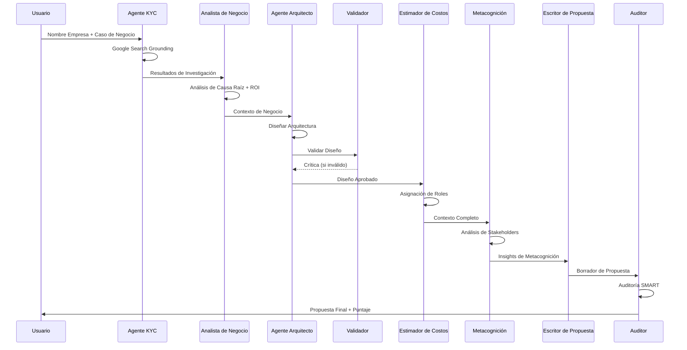

# Nubiral BSA – Agente Arquitecto GenAI

> **Plataforma de Generación de Propuestas Técnicas con IA**  
> Versión 2.0 | Diciembre 2024


## 🎯 Descripción General

Nubiral BSA es un **sistema de IA agéntico** que automatiza la creación de propuestas técnicas de arquitectura cloud. Orquesta un pipeline multi-agente para investigar empresas, analizar casos de negocio, diseñar soluciones cloud, estimar costos y generar documentación profesional—todo impulsado por los modelos Gemini de Google.

```mermaid
graph LR
    A[📝 Entrada Usuario] --> B[🔍 Agente KYC]
    B --> C[📊 Analista de Negocio]
    C --> D[🏗️ Agente Arquitecto]
    D --> E[✓ Validador]
    E -->|Inválido| D
    E -->|Válido| F[💰 Estimador de Costos]
    F --> G[🧠 Metacognición]
    G --> H[📄 Generador de Propuesta]
    H --> I[✅ Auditor SMART]
    I -->|Puntaje < 90| H
    I -->|Puntaje ≥ 90| J[📋 Propuesta Final]
```



### 🔄 Bucle de Evaluación SMART

El sistema incluye un **bucle de aseguramiento de calidad automatizado**:

1. **Propuesta Generada** → Enviada al Auditor SMART
2. **Puntaje SMART Calculado** (0-100) basado en:
   - **S**pecific (Específico): Objetivos y entregables claros
   - **M**easurable (Medible): Métricas de éxito cuantificables
   - **A**chievable (Alcanzable): Alcance y cronograma realistas
   - **R**elevant (Relevante): Alineado con necesidades del negocio
   - **T**ime-bound (Temporal): Hitos definidos
3. **Si Puntaje < 90 O Problemas Críticos Encontrados**:
   - Retroalimentación extraída de la evaluación
   - Propuesta regenerada con correcciones
   - Re-evaluada hasta alcanzar el umbral de calidad


## ✨ Características Principales

| Característica | Descripción |
|----------------|-------------|
| **🔍 Investigación KYC** | Búsqueda Google con grounding para inteligencia empresarial en tiempo real |
| **📊 Análisis de Negocio** | Análisis de causa raíz, puntos de dolor, modelado de ROI |
| **🏗️ Diseño de Arquitectura** | Soporte multi-cloud (AWS, Azure, GCP, OCI) con diagramas Mermaid |
| **💰 Estimación de Costos** | Asignación semanal por roles con indicadores de estrés |
| **🧠 Metacognición** | Análisis de consonancia/disonancia entre stakeholders |
| **🖼️ Infografías IA** | Visualizaciones auto-generadas para cada sección |
| **💾 Gestión de Sesiones** | Persistencia IndexedDB para guardar/cargar entre sesiones |
| **🌐 Multi-idioma** | Inglés, Español, Portugués, Francés, Alemán |

---

## 🚀 Inicio Rápido

### Prerrequisitos

- Node.js 18+
- API Key de Google AI (acceso a Gemini 2.5/3.0)

### Instalación

```bash
# Clonar repositorio
git clone https://github.com/nubiral/bsa-agent.git
cd bsa-agent

# Instalar dependencias
npm install

# Configurar API Key
echo "API_KEY=tu_api_key_gemini" > .env.local

# Iniciar servidor de desarrollo
npm run dev
```

### Acceso

Abrir `http://localhost:5173` en el navegador.

---

## 📁 Estructura del Proyecto

```
nubi-bsa-propv1/
├── App.tsx                 # Orquestador principal
├── types.ts                # Interfaces TypeScript
├── services/
│   ├── geminiService.ts    # Funciones de Agentes IA (42 exports)
│   └── sessionService.ts   # Persistencia IndexedDB
├── components/
│   ├── InputStep.tsx       # Formulario de solicitud
│   ├── ProcessingStep.tsx  # Consola del agente
│   ├── ResultStep.tsx      # Visor de resultados multi-tab
│   ├── ChatWidget.tsx      # Asistente experto
│   └── SessionManager.tsx  # Barra lateral de sesiones
├── prompts/                # Plantillas de prompts IA
├── config/
│   └── models.ts           # Configuración de modelos
└── utils/
    └── logoUtils.ts        # Composición de imágenes
```

---

## 🧠 Pipeline de Agentes



---

## ⚙️ Configuración

### Configuración del Agente

| Parámetro | Predeterminado | Descripción |
|-----------|----------------|-------------|
| `textModel` | `gemini-3-pro-preview` | Modelo de razonamiento (Pro/Flash) |
| `imageModel` | `gemini-2.5-flash-image` | Modelo de generación de imágenes |
| `contextDensity` | `high` | Filtrado de información (low/medium/high) |
| `apiDelay` | `0` | Pausa entre llamadas API (0-10s) |

### Variables de Entorno

```env
API_KEY=tu_api_key_gemini
```

---

## 📊 Hyperscalers Soportados

| Proveedor | Servicios Incluidos |
|-----------|---------------------|
| AWS | EC2, Lambda, EKS, S3, RDS, DynamoDB, SageMaker, Bedrock |
| Azure | AKS, App Service, Cosmos DB, Azure ML, OpenAI Service |
| GCP | GKE, Cloud Run, BigQuery, Vertex AI, Gemini |
| OCI | OKE, Autonomous DB, AI Services |

---

## 🔐 Gestión de Sesiones

Las sesiones se almacenan localmente en **IndexedDB**, soportando:

- Persistencia de estado completo (incluyendo imágenes base64)
- Guardar/Cargar entre sesiones del navegador
- Lista de sesiones con vista previa de metadatos

Acceder mediante el **icono de carpeta 📁** en la cabecera superior izquierda.

---

## 📝 Licencia

Propietario – Equipo BSA Nubiral LATAM

---

## 🤝 Contribuir

Proyecto interno. Contactar al equipo BSA para acceso.

---

<p align="center">
  <strong>Nubiral BSA Agent</strong> – Automatizando la Excelencia Técnica
</p>
