# Nubiral BSA – System Specification

> **Technical Architecture & Implementation Reference**  
> Version 2.0 | December 2024

---

## 1. System Architecture Overview

```mermaid
flowchart TB
    subgraph Frontend["🖥️ Frontend (React + TypeScript)"]
        UI[App.tsx - Orchestrator]
        IS[InputStep.tsx]
        PS[ProcessingStep.tsx]
        RS[ResultStep.tsx]
        SM[SessionManager.tsx]
        CW[ChatWidget.tsx]
    end

    subgraph Services["⚙️ Service Layer"]
        GS[geminiService.ts]
        SS[sessionService.ts]
        LU[logoUtils.ts]
    end

    subgraph Prompts["📝 Prompt Engineering"]
        KP[kyc.ts]
        BP[business.ts]
        AP[architect.ts]
        PP[proposal.ts]
        EP[evaluator.ts]
        CP[cost.ts]
        VP[validator.ts]
        IP[infographics.ts]
        MP[metacognition.ts]
    end

    subgraph External["🌐 External APIs"]
        GM[Google Gemini API]
        GS_API[Google Search Grounding]
        CB[Clearbit Logo API]
    end

    subgraph Storage["💾 Persistence"]
        IDB[(IndexedDB)]
    end

    UI --> IS & PS & RS & SM & CW
    RS --> GS
    GS --> Prompts
    GS --> GM & GS_API
    LU --> CB
    SS --> IDB
```



---

## 2. Agent Pipeline Architecture

The system implements a **multi-agent orchestration pattern** where specialized AI agents process sequentially, each building on artifacts from previous stages.

```mermaid
flowchart LR
    subgraph Phase1["Phase 1: Research"]
        KYC[🔍 KYC Agent<br/>conductResearch]
        KYC_IMG[📷 KYC Infographic]
    end

    subgraph Phase2["Phase 2: Analysis"]
        BIZ[📊 Business Analyst<br/>analyzeBusinessCase]
        BIZ_IMG[📷 Business Infographic]
    end

    subgraph Phase3["Phase 3: Design"]
        ARCH[🏗️ Architect Agent<br/>designSolution]
        VAL[✓ Validator<br/>validateSolutionDesign]
        ARCH_IMG[📷 Architecture Infographic]
    end

    subgraph Phase4["Phase 4: Costing"]
        COST[💰 Cost Estimator<br/>generateCostEstimation]
        COST_IMG[📷 Cost Infographic]
    end

    subgraph Phase5["Phase 5: Metacognition"]
        META[🧠 Metacognition<br/>analyzeMetacognition]
        META_IMG[📷 Meta Infographic]
    end

    subgraph Phase6["Phase 6: Generation & Audit"]
        PROP[📄 Proposal Writer<br/>generateProposal]
        COVER[📷 Cover Image]
        AUDIT[✅ SMART Auditor<br/>evaluateProposal]
        SCORE{Score ≥ 90?}
        REFINE[🔄 Auto-Correction<br/>extractImprovements]
        FINAL[📋 Final Proposal]
    end

    KYC --> KYC_IMG --> BIZ
    BIZ --> BIZ_IMG --> ARCH
    ARCH <--> VAL
    ARCH --> ARCH_IMG --> COST
    COST --> COST_IMG --> META
    META --> META_IMG --> PROP
    PROP --> COVER --> AUDIT
    AUDIT --> SCORE
    SCORE -->|No| REFINE
    REFINE --> PROP
    SCORE -->|Yes| FINAL
```



---

## 2.1 SMART Evaluation Loop Detail

The **SMART Auditor** is a critical quality gate that ensures proposals meet professional standards:

```mermaid
flowchart TD
    A[📄 Generated Proposal] --> B[✅ SMART Auditor]
    B --> C[Calculate Score 0-100]
    C --> D{Score ≥ 90?}
    D -->|No| E[Extract Critical Issues]
    E --> F[Generate Improvement Feedback]
    F --> G[🔄 Regenerate Proposal<br/>with Corrections]
    G --> B
    D -->|Yes| H{Critical Issues?}
    H -->|Yes| E
    H -->|No| I[✅ Quality Approved]
    I --> J[📋 Final Proposal]
```



**SMART Criteria Evaluated:**

| Criterion | Weight | Description |
|-----------|--------|-------------|
| **Specific** | 20% | Clear objectives, defined deliverables |
| **Measurable** | 20% | Quantifiable KPIs, success metrics |
| **Achievable** | 20% | Realistic scope, resource alignment |
| **Relevant** | 20% | Business need alignment, ROI justification |
| **Time-bound** | 20% | Defined milestones, timeline clarity |

**Loop Termination Conditions:**
- Score ≥ 90 AND no critical issues → Approved
- Maximum 2 refinement iterations → Forced approval with warnings


## 3. Data Model (TypeScript Interfaces)

### 3.1 Core Request/Response Types


### 3.2 Cost Estimation Model


### 3.3 Metacognition Model


---

## 4. Service Layer Functions

### 4.1 geminiService.ts (42 Exported Functions)

| Category | Function | Purpose |
|----------|----------|---------|
| **Research** | `conductResearch` | KYC via Google Search grounding |
| | `researchArchitectServices` | Cloud service lookup |
| **Analysis** | `analyzeBusinessCase` | Problem/ROI analysis |
| | `expandBusinessSection` | Deep-dive expansion |
| **Design** | `designSolution` | Architecture generation |
| | `validateSolutionDesign` | Logic validation loop |
| | `refineDesign` | User-directed refinement |
| **Costing** | `generateCostEstimation` | Role allocation |
| | `refineCostEstimation` | Iterative refinement |
| **Metacognition** | `analyzeMetacognition` | Stakeholder analysis |
| | `expandMetacognitionSection` | Section expansion |
| **Proposal** | `generateProposal` | Markdown document |
| | `evaluateProposal` | SMART audit scoring |
| **Images** | `generateKYCInfographic` | Research visualization |
| | `generateBusinessInfographic` | Business case visual |
| | `generateArchitectureInfographic` | Architecture diagram |
| | `generateCostInfographic` | Cost breakdown visual |
| | `generateMetacognitionInfographic` | Stakeholder map |
| | `generateCoverWithLogos` | Cover + logo compositing |

### 4.2 sessionService.ts (IndexedDB)

| Function | Purpose |
|----------|---------|
| `openDB()` | Initialize/open IndexedDB |
| `saveSession(session)` | Create or update session |
| `loadSession(id)` | Retrieve full session |
| `listSessions()` | Get all session summaries |
| `deleteSession(id)` | Remove session |

---

## 5. Context Density Filtering

The system implements a **context filter** that simulates human information handoff:


| Level | Token Impact | Use Case |
|-------|--------------|----------|
| High | ~8000 tokens | Complex enterprise projects |
| Medium | ~4000 tokens | Standard proposals |
| Low | ~2000 tokens | Quick drafts, rate limit management |

---

## 6. Image Generation Pipeline


---

## 7. State Management

### 7.1 Application State (App.tsx)

```typescript
// Core State
const [step, setStep] = useState<AppStep>(AppStep.INPUT);
const [currentRequest, setCurrentRequest] = useState<ProposalRequest | null>(null);

// Agent Artifacts
const [researchResult, setResearchResult] = useState<ResearchResult | null>(null);
const [businessAnalysis, setBusinessAnalysis] = useState<BusinessAnalysis | null>(null);
const [solutionDesign, setSolutionDesign] = useState<SolutionDesign | null>(null);
const [costEstimation, setCostEstimation] = useState<CostEstimation | null>(null);
const [metacognitionAnalysis, setMetacognitionAnalysis] = useState<MetacognitionAnalysis | null>(null);
const [proposalImages, setProposalImages] = useState<ProposalImages | null>(null);
const [resultMarkdown, setResultMarkdown] = useState<string>('');

// Session Management
const [currentSessionId, setCurrentSessionId] = useState<string | null>(null);
const [isSessionManagerOpen, setIsSessionManagerOpen] = useState(false);
```

### 7.2 Persistence Schema (IndexedDB)


---

## 8. UI Component Architecture


---

## 9. Rate Limiting & Error Handling


---

## 10. Security Considerations

| Aspect | Implementation |
|--------|----------------|
| API Key | Environment variable (.env.local) |
| Data Storage | Client-side only (IndexedDB) |
| Network | HTTPS to Google APIs |
| Images | Base64 encoded, no external hosting |
| Session Data | Local browser storage, no server sync |

---

## 11. Performance Characteristics

| Metric | Typical Value |
|--------|---------------|
| Full pipeline execution | 60-120 seconds |
| Single image generation | 5-15 seconds |
| Session save/load | < 500ms |
| Context filtering (Low) | ~60% token reduction |

---

## 12. Extension Points

| Extension | Implementation Path |
|-----------|---------------------|
| New Hyperscaler | Add to `HyperScaler` type + prompts |
| New Language | Add translations to `ResultStep.tsx` |
| New AI Model | Update `config/models.ts` |
| New Agent | Create prompt in `/prompts/`, add function to `geminiService.ts` |
| New Infographic | Add type to `ProposalImages`, create generator function |

---

<p align="center">
<strong>Nubiral BSA System Specification v2.0</strong>
</p>
