# Nubiral BSA – Especificación del Sistema

> **Referencia de Arquitectura Técnica e Implementación**  
> Versión 2.0 | Diciembre 2024

---

## 1. Arquitectura General del Sistema

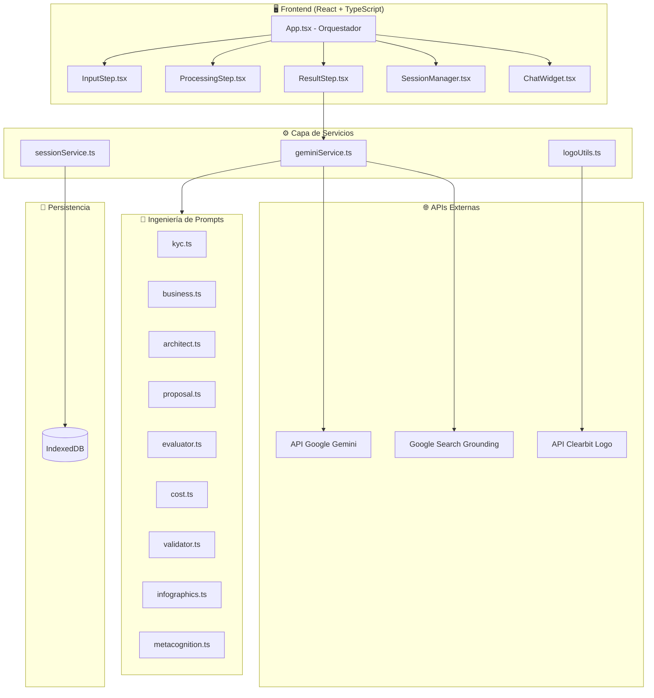

---

## 2. Arquitectura del Pipeline de Agentes

El sistema implementa un **patrón de orquestación multi-agente** donde agentes de IA especializados procesan secuencialmente, cada uno construyendo sobre artefactos de etapas anteriores.

```mermaid
flowchart LR
    subgraph Fase1["Fase 1: Investigación"]
        KYC[🔍 Agente KYC<br/>conductResearch]
        KYC_IMG[📷 Infografía KYC]
    end

    subgraph Fase2["Fase 2: Análisis"]
        BIZ[📊 Analista de Negocio<br/>analyzeBusinessCase]
        BIZ_IMG[📷 Infografía Negocio]
    end

    subgraph Fase3["Fase 3: Diseño"]
        ARCH[🏗️ Agente Arquitecto<br/>designSolution]
        VAL[✓ Validador<br/>validateSolutionDesign]
        ARCH_IMG[📷 Infografía Arquitectura]
    end

    subgraph Fase4["Fase 4: Costeo"]
        COST[💰 Estimador de Costos<br/>generateCostEstimation]
        COST_IMG[📷 Infografía Costos]
    end

    subgraph Fase5["Fase 5: Metacognición"]
        META[🧠 Metacognición<br/>analyzeMetacognition]
        META_IMG[📷 Infografía Meta]
    end

    subgraph Fase6["Fase 6: Generación y Auditoría"]
        PROP[📄 Escritor de Propuesta<br/>generateProposal]
        COVER[📷 Imagen Portada]
        AUDIT[✅ Auditor SMART<br/>evaluateProposal]
        SCORE{¿Puntaje ≥ 90?}
        REFINE[🔄 Auto-Corrección<br/>extractImprovements]
        FINAL[📋 Propuesta Final]
    end

    KYC --> KYC_IMG --> BIZ
    BIZ --> BIZ_IMG --> ARCH
    ARCH <--> VAL
    ARCH --> ARCH_IMG --> COST
    COST --> COST_IMG --> META
    META --> META_IMG --> PROP
    PROP --> COVER --> AUDIT
    AUDIT --> SCORE
    SCORE -->|No| REFINE
    REFINE --> PROP
    SCORE -->|Sí| FINAL
```

---

## 2.1 Detalle del Bucle de Evaluación SMART

El **Auditor SMART** es una puerta de calidad crítica que asegura que las propuestas cumplan estándares profesionales:

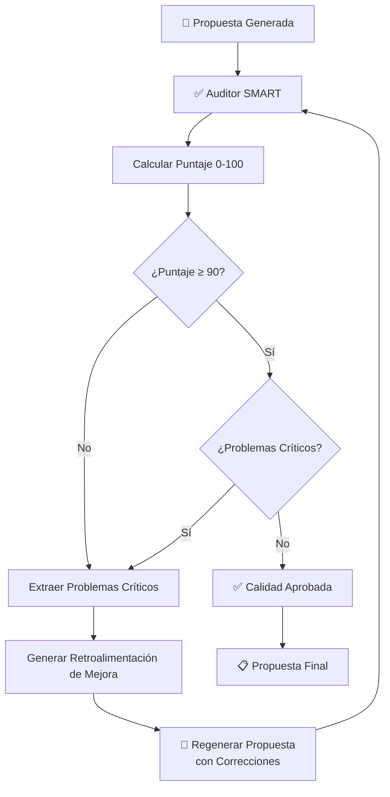

**Criterios SMART Evaluados:**

| Criterio | Peso | Descripción |
|----------|------|-------------|
| **Specific** (Específico) | 20% | Objetivos claros, entregables definidos |
| **Measurable** (Medible) | 20% | KPIs cuantificables, métricas de éxito |
| **Achievable** (Alcanzable) | 20% | Alcance realista, alineación de recursos |
| **Relevant** (Relevante) | 20% | Alineación con necesidad de negocio, justificación ROI |
| **Time-bound** (Temporal) | 20% | Hitos definidos, claridad de cronograma |

**Condiciones de Terminación del Bucle:**
- Puntaje ≥ 90 Y sin problemas críticos → Aprobado
- Máximo 2 iteraciones de refinamiento → Aprobación forzada con advertencias


## 3. Modelo de Datos (Interfaces TypeScript)

### 3.1 Tipos de Solicitud/Respuesta

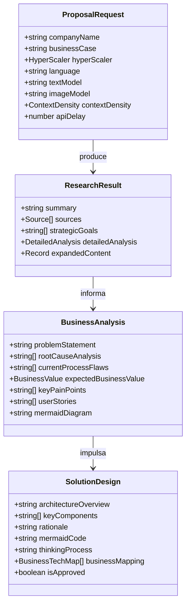

### 3.2 Modelo de Estimación de Costos

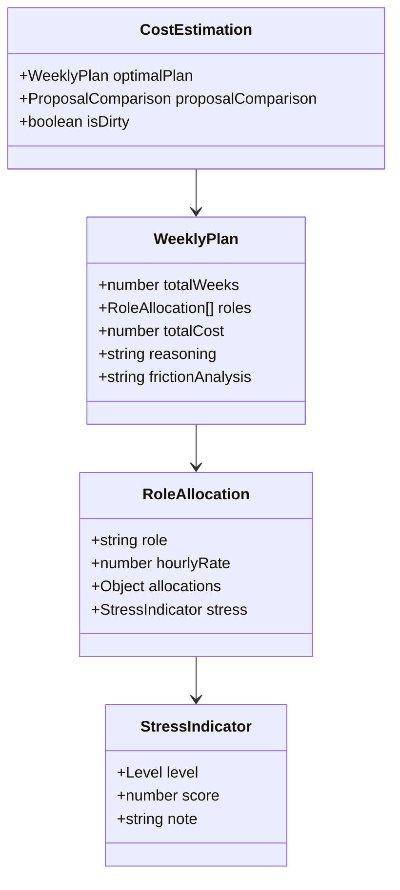

### 3.3 Modelo de Metacognición

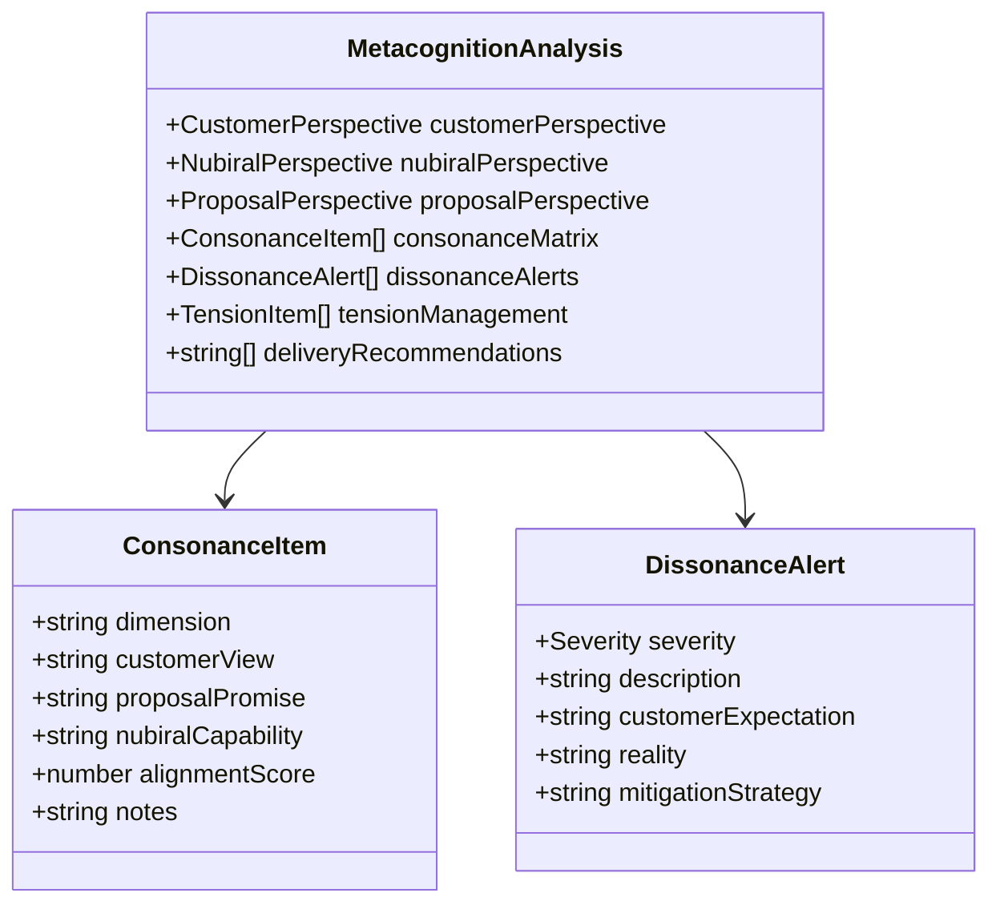

---

## 4. Funciones de la Capa de Servicios

### 4.1 geminiService.ts (42 Funciones Exportadas)

| Categoría | Función | Propósito |
|-----------|---------|-----------|
| **Investigación** | `conductResearch` | KYC vía Google Search grounding |
| | `researchArchitectServices` | Búsqueda de servicios cloud |
| **Análisis** | `analyzeBusinessCase` | Análisis de problema/ROI |
| | `expandBusinessSection` | Expansión profunda |
| **Diseño** | `designSolution` | Generación de arquitectura |
| | `validateSolutionDesign` | Bucle de validación lógica |
| | `refineDesign` | Refinamiento dirigido por usuario |
| **Costeo** | `generateCostEstimation` | Asignación de roles |
| | `refineCostEstimation` | Refinamiento iterativo |
| **Metacognición** | `analyzeMetacognition` | Análisis de stakeholders |
| | `expandMetacognitionSection` | Expansión de sección |
| **Propuesta** | `generateProposal` | Documento Markdown |
| | `evaluateProposal` | Puntuación auditoría SMART |
| **Imágenes** | `generateKYCInfographic` | Visualización de investigación |
| | `generateBusinessInfographic` | Visual de caso de negocio |
| | `generateArchitectureInfographic` | Diagrama de arquitectura |
| | `generateCostInfographic` | Visual de desglose de costos |
| | `generateMetacognitionInfographic` | Mapa de stakeholders |
| | `generateCoverWithLogos` | Portada + composición de logos |

### 4.2 sessionService.ts (IndexedDB)

| Función | Propósito |
|---------|-----------|
| `openDB()` | Inicializar/abrir IndexedDB |
| `saveSession(session)` | Crear o actualizar sesión |
| `loadSession(id)` | Recuperar sesión completa |
| `listSessions()` | Obtener resúmenes de sesiones |
| `deleteSession(id)` | Eliminar sesión |

---

## 5. Filtrado de Densidad de Contexto

El sistema implementa un **filtro de contexto** que simula el traspaso de información humano:

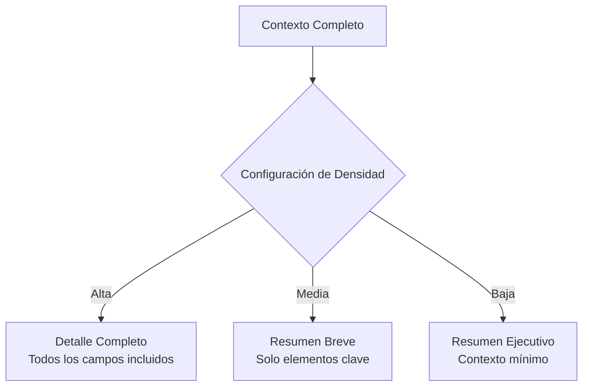

| Nivel | Impacto en Tokens | Caso de Uso |
|-------|-------------------|-------------|
| Alto | ~8000 tokens | Proyectos empresariales complejos |
| Medio | ~4000 tokens | Propuestas estándar |
| Bajo | ~2000 tokens | Borradores rápidos, gestión de límites |

---

## 6. Pipeline de Generación de Imágenes

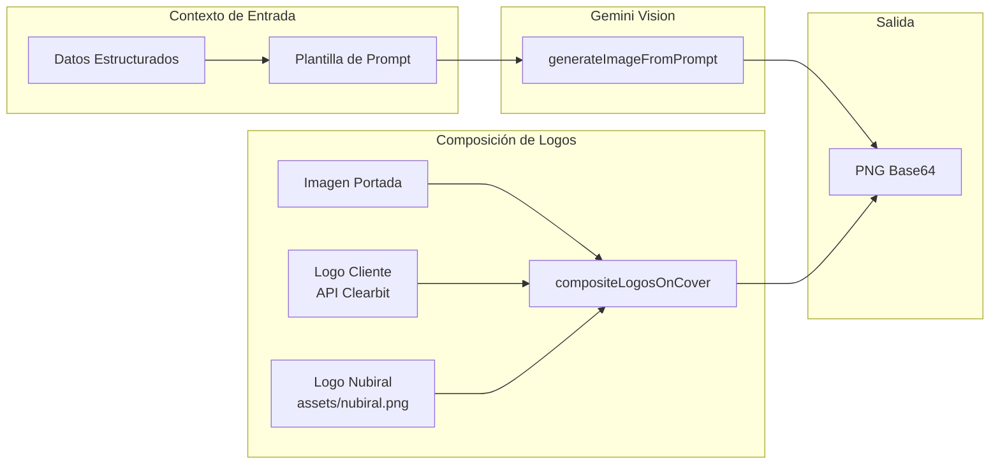

---

## 7. Gestión de Estado

### 7.1 Estado de la Aplicación (App.tsx)

```typescript
// Estado Principal
const [step, setStep] = useState<AppStep>(AppStep.INPUT);
const [currentRequest, setCurrentRequest] = useState<ProposalRequest | null>(null);

// Artefactos de Agentes
const [researchResult, setResearchResult] = useState<ResearchResult | null>(null);
const [businessAnalysis, setBusinessAnalysis] = useState<BusinessAnalysis | null>(null);
const [solutionDesign, setSolutionDesign] = useState<SolutionDesign | null>(null);
const [costEstimation, setCostEstimation] = useState<CostEstimation | null>(null);
const [metacognitionAnalysis, setMetacognitionAnalysis] = useState<MetacognitionAnalysis | null>(null);
const [proposalImages, setProposalImages] = useState<ProposalImages | null>(null);
const [resultMarkdown, setResultMarkdown] = useState<string>('');

// Gestión de Sesiones
const [currentSessionId, setCurrentSessionId] = useState<string | null>(null);
const [isSessionManagerOpen, setIsSessionManagerOpen] = useState(false);
```

### 7.2 Esquema de Persistencia (IndexedDB)

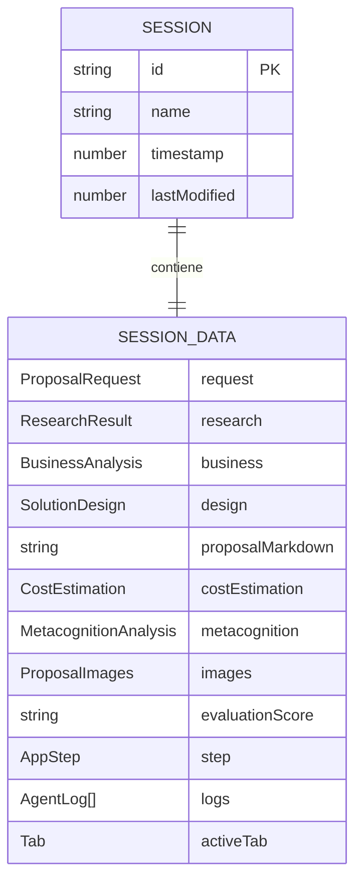

---

## 8. Arquitectura de Componentes UI

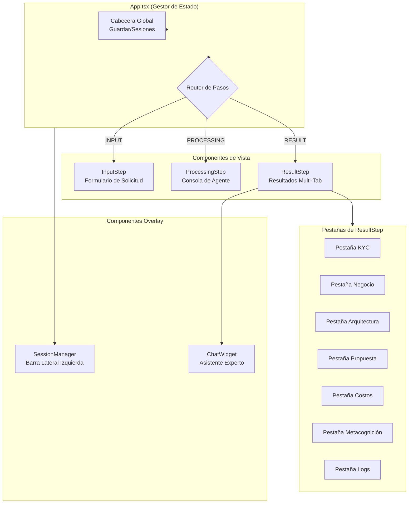

---

## 9. Limitación de Tasa y Manejo de Errores

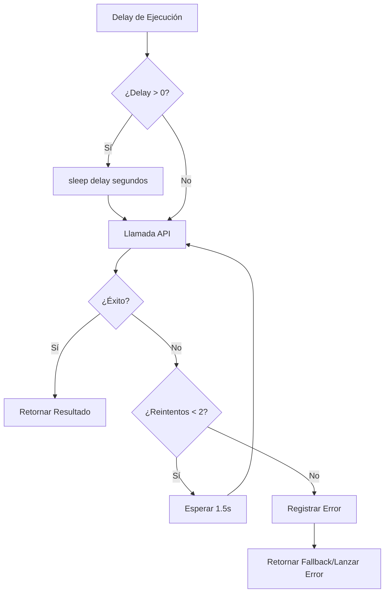

---

## 10. Consideraciones de Seguridad

| Aspecto | Implementación |
|---------|----------------|
| API Key | Variable de entorno (.env.local) |
| Almacenamiento de Datos | Solo lado cliente (IndexedDB) |
| Red | HTTPS hacia APIs de Google |
| Imágenes | Codificadas en Base64, sin hosting externo |
| Datos de Sesión | Almacenamiento local del navegador, sin sincronización con servidor |

---

## 11. Características de Rendimiento

| Métrica | Valor Típico |
|---------|--------------|
| Ejecución completa del pipeline | 60-120 segundos |
| Generación de imagen individual | 5-15 segundos |
| Guardar/cargar sesión | < 500ms |
| Filtrado de contexto (Bajo) | ~60% reducción de tokens |

---

## 12. Puntos de Extensión

| Extensión | Ruta de Implementación |
|-----------|------------------------|
| Nuevo Hyperscaler | Agregar al tipo `HyperScaler` + prompts |
| Nuevo Idioma | Agregar traducciones a `ResultStep.tsx` |
| Nuevo Modelo IA | Actualizar `config/models.ts` |
| Nuevo Agente | Crear prompt en `/prompts/`, agregar función a `geminiService.ts` |
| Nueva Infografía | Agregar tipo a `ProposalImages`, crear función generadora |

---

<p align="center">
<strong>Especificación del Sistema Nubiral BSA v2.0</strong>
</p>
